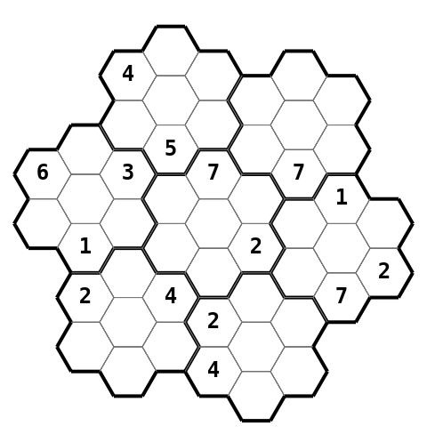

# Hex-udoku

Hex-udoku is a hexagonal Sudoku puzzle game built with React, TypeScript, and Vite. It provides a fun and different challenge compared to regular Sudoku.



## Features

- Sudoku-like challenge
- Hexagonal grid

## Why

Because hexagons!

## Prerequisites

Before setting up the project, ensure you have the following installed:

- [Node.js](https://nodejs.org/) (version 22 or higher)
- [npm](https://www.npmjs.com/) (comes with Node.js)

## Setup Instructions

1. Clone the repository:

   ```bash
   git clone https://github.com/Schmoller/Hex-udoku.git
   ```

2. Navigate to the project directory:

   ```bash
   cd hexudoku
   ```

3. Install dependencies:

   ```bash
   npm install
   ```

## Running the Project

To start the development server:

```bash
npm run dev
```

This will start the Vite development server and you can access the application at `http://localhost:5173`.

## License

This project is licensed under the MIT License. See the LICENSE file for details.

